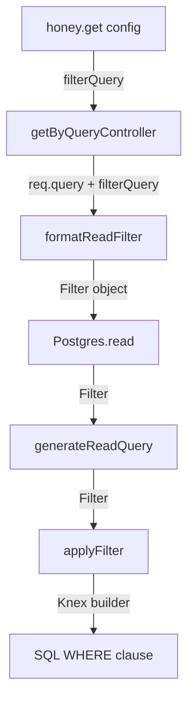
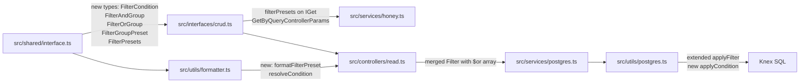

# Compound Filter Logic — Architectural Plan

## 1. Executive Summary

The honey framework currently supports flat `AND`-only filter conditions. This plan extends the filter system to support **compound `OR` groups containing nested `AND` conditions** — without breaking any existing usage. The approach introduces a new `filterGroups` parameter alongside the existing `filter` parameter, and extends the internal `Filter` / `GetQueryFilter` types to carry a recursive `$or` node that can itself contain nested `$and` groups.

---

## 2. Current Architecture — Data Flow



### Key observations

| Layer | File | Current behaviour |
|---|---|---|
| Public API | [`honey.get()`](../src/services/honey.ts:152) | Accepts `filter?: GetQueryFilter` |
| Interface | [`IGet`](../src/interfaces/crud.ts:94) | `filter?: GetQueryFilter` |
| Shared type | [`GetQueryFilter`](../src/shared/interface.ts:59) | `{ [key: string]: GetFilterParam \| Record<string, GetFilterParam> }` |
| Formatter | [`formatReadFilter()`](../src/utils/formatter.ts:87) | Iterates entries; handles `$or` key shallowly (one level deep) |
| DB builder | [`applyFilter()`](../src/utils/postgres.ts:73) | Handles `$or` shallowly — each `$or` value must be a flat `FilterParam` |
| Postgres service | [`Postgres.read()`](../src/services/postgres.ts:14) | Passes `Filter` straight to `generateReadQuery` |

### The gap

The existing `$or` support in [`applyFilter()`](../src/utils/postgres.ts:76) only handles **flat** `OR` conditions — each entry inside `$or` must be a single `FilterParam`. It cannot express:

```sql
WHERE status = 'completed'
   OR (status = 'confirmed' AND scheduled_at < NOW())
```

because the inner `AND` group is not representable in the current type.

---

## 3. Target SQL Patterns

| Preset | SQL |
|---|---|
| All | *(no WHERE clause)* |
| Upcoming | `WHERE status = 'confirmed' AND scheduled_at > :now` |
| Completed | `WHERE status = 'completed' OR (status = 'confirmed' AND scheduled_at < :now)` |
| Cancelled | `WHERE status = 'cancelled'` |

---

## 4. Proposed Type Changes

### 4.1 `src/shared/interface.ts`

Introduce a recursive `FilterGroup` type that can represent arbitrarily nested `AND`/`OR` trees, and a new `GetFilterGroup` type for the config-time (pre-request) equivalent.

```ts
// ── Runtime filter (post-formatter, passed to applyFilter) ──────────────────

/** A single field condition */
export type FilterParam = OperationParam<FilterOps>;

/** A group of conditions joined by AND */
export interface FilterAndGroup {
  $and: FilterCondition[];
}

/** A group of conditions joined by OR */
export interface FilterOrGroup {
  $or: FilterCondition[];
}

/**
 * A single condition is either:
 *   - a field-level predicate  { field: FilterParam }
 *   - a nested AND group       { $and: FilterCondition[] }
 *   - a nested OR group        { $or: FilterCondition[] }
 */
export type FilterCondition =
  | { [field: string]: FilterParam }
  | FilterAndGroup
  | FilterOrGroup;

/**
 * Top-level Filter: flat AND map (existing) PLUS an optional $or key
 * that now carries FilterCondition[] instead of a flat record.
 * Existing callers are unaffected.
 */
export interface Filter {
  [key: string]:
    | FilterParam
    | Record<string, FilterParam>   // legacy $or shape — kept for compat
    | FilterCondition[];            // new $or shape
}

// ── Config-time filter group (passed to honey.get / IGet) ───────────────────

/** A single config-time condition inside a group */
export type GetFilterCondition =
  | { [field: string]: GetFilterParam }
  | { $and: GetFilterCondition[] }
  | { $or: GetFilterCondition[] };

/**
 * A named preset maps to an array of top-level OR branches.
 * Each branch is either a single field condition or a nested AND/OR group.
 *
 * Example — "Completed" preset:
 * [
 *   { status: { operator: '=', value: 'as-is', overrideValue: 'completed' } },
 *   { $and: [
 *       { status:      { operator: '=', value: 'as-is', overrideValue: 'confirmed' } },
 *       { scheduledAt: { operator: '<', value: 'as-is', overrideValue: () => new Date() } }
 *   ]}
 * ]
 */
export type FilterGroupPreset = GetFilterCondition[];

/**
 * A map of named presets.  The key is the preset name the caller sends
 * in the query-string (e.g. ?preset=completed).
 */
export type FilterPresets = Record<string, FilterGroupPreset>;
```

> **Backward compatibility:** The existing `Filter` and `GetQueryFilter` types are extended, not replaced. All existing `filter` usages continue to work unchanged.

---

### 4.2 `src/interfaces/crud.ts`

Add `filterPresets` to `IGet`, `GetByQueryControllerParams`, and (optionally) `IGetById` / `GetByIdControllerParams`.

```ts
import { FilterPresets, GetQueryFilter, Join } from '../shared/interface';

export type IGet = CrudParams & {
  fields: string[];
  filter?: GetQueryFilter;
  /** Named compound filter presets. Activated via ?preset=<name> query param. */
  filterPresets?: FilterPresets;
  format?: { sort: 'ASC' | 'DESC'; sortField: string };
  joins?: Join[];
  processResponseData?: (data: any, req: Request) => any;
  shouldErrorOnNotFound?: boolean;
};

export interface GetByQueryControllerParams extends ControllerParams {
  fields: string[];
  filterQuery?: GetQueryFilter;
  /** Named compound filter presets. Activated via ?preset=<name> query param. */
  filterPresets?: FilterPresets;
  format?: { sort: 'ASC' | 'DESC'; sortField: string };
  joins?: Join[];
  shouldErrorOnNotFound?: boolean;
}
```

---

## 5. Formatter Changes

### 5.1 `src/utils/formatter.ts`

Add a new exported function `formatFilterPreset` that resolves a named preset into a runtime `FilterCondition[]` (the new `$or` array shape). The existing [`formatReadFilter()`](../src/utils/formatter.ts:87) is **not modified**.

```ts
import { FilterCondition, FilterParam, FilterPresets, GetFilterCondition } from '../shared/interface';

/**
 * Recursively resolves a GetFilterCondition (config-time) into a
 * runtime FilterCondition, evaluating overrideValue functions against req.
 */
function resolveCondition(condition: GetFilterCondition, req: Request): FilterCondition {
  if ('$and' in condition) {
    return { $and: condition.$and.map(c => resolveCondition(c, req)) };
  }
  if ('$or' in condition) {
    return { $or: condition.$or.map(c => resolveCondition(c, req)) };
  }

  // Field-level condition
  const result: { [field: string]: FilterParam } = {};
  for (const [field, param] of Object.entries(condition)) {
    let value: any;
    if (param.overrideValue !== undefined) {
      value = typeof param.overrideValue === 'function'
        ? param.overrideValue(req)
        : param.overrideValue;
    } else if (param.location) {
      value = retrieveParamFromLocation(req, param.location, field);
    } else {
      // No override and no location — skip (preset conditions should always
      // use overrideValue or location)
      continue;
    }
    const formatter = formatters[param.value];
    result[field] = { operator: param.operator, value: formatter(value) };
  }
  return result;
}

/**
 * Resolves a named preset from filterPresets into a runtime FilterCondition[].
 * Returns undefined if the preset name is not found.
 */
export const formatFilterPreset = (
  presetName: string,
  filterPresets: FilterPresets,
  req: Request
): FilterCondition[] | undefined => {
  const preset = filterPresets[presetName];
  if (!preset) return undefined;
  return preset.map(condition => resolveCondition(condition, req));
};
```

---

## 6. DB Query Builder Changes

### 6.1 `src/utils/postgres.ts` — extend `applyFilter()`

The key change is making [`applyFilter()`](../src/utils/postgres.ts:73) handle the new recursive `FilterCondition[]` shape for `$or`, while keeping the existing flat-record `$or` path for backward compatibility.

```ts
import { Filter, FilterCondition, FilterParam } from '../shared/interface';

/**
 * Recursively applies a FilterCondition to a Knex builder.
 * Used internally by applyFilter for nested $and / $or groups.
 */
const applyCondition = (
  builder: Knex.QueryBuilder,
  condition: FilterCondition,
  method: 'where' | 'orWhere' = 'where'
): void => {
  if ('$and' in condition) {
    builder[method]((andBuilder) => {
      condition.$and.forEach((c) => applyCondition(andBuilder, c, 'where'));
    });
    return;
  }
  if ('$or' in condition) {
    builder[method]((orBuilder) => {
      condition.$or.forEach((c, i) =>
        applyCondition(orBuilder, c, i === 0 ? 'where' : 'orWhere')
      );
    });
    return;
  }

  // Field-level predicate
  for (const [field, param] of Object.entries(condition as { [f: string]: FilterParam })) {
    const p = param as FilterParam;
    if (['like', 'not like'].includes(p.operator)) {
      builder[method](field, p.operator === 'like' ? 'ilike' : 'not ilike', `%${p.value}%`);
    } else {
      builder[method](field, p.operator, p.value);
    }
  }
};

export const applyFilter = (query: Knex.QueryBuilder, filter: Filter = {}) => {
  Object.entries(filter).forEach(([field, data]) => {
    if (field === '$or') {
      // NEW: array shape (FilterCondition[]) — compound OR groups
      if (Array.isArray(data)) {
        query.where((builder) => {
          (data as FilterCondition[]).forEach((condition, i) => {
            applyCondition(builder, condition, i === 0 ? 'where' : 'orWhere');
          });
        });
      } else {
        // LEGACY: flat record shape — existing behaviour preserved
        query.where((builder) => {
          Object.entries(data).forEach(([orField, orData], index) => {
            const method = index === 0 ? 'where' : 'orWhere';
            const orParam = orData as FilterParam;
            if (['like', 'not like'].includes(orParam.operator)) {
              builder[method](orField, 'ilike', `%${orParam.value}%`);
            } else {
              builder[method](orField, orParam.operator, orParam.value);
            }
          });
        });
      }
    } else {
      // Existing AND field handling — unchanged
      const param = data as FilterParam;
      if (['like', 'not like'].includes(param.operator)) {
        query.where(field, param.operator === 'like' ? 'ilike' : 'not ilike', `%${param.value}%`);
      } else {
        query.where(field, param.operator, param.value);
      }
    }
  });

  return query;
};
```

The `$or` array is merged into the `Filter` object under the `$or` key before being passed to `applyFilter`. This means `generateReadQuery` and `Postgres.read` require **no changes** — they already accept a `Filter` and call `applyFilter`.

---

## 7. Controller Changes

### 7.1 `src/controllers/read.ts` — `getByQueryController`

The controller needs to:
1. Read the `?preset=<name>` query parameter.
2. If a preset is found and `filterPresets` is configured, resolve it via `formatFilterPreset`.
3. Merge the resolved `FilterCondition[]` into the existing `filter` object under the `$or` key.

```ts
export function getByQueryController({
  db,
  resource,
  fields,
  filterQuery,
  filterPresets,       // ← new
  format,
  processResponseData,
  processErrorResponse,
  joins,
  shouldErrorOnNotFound
}: GetByQueryControllerParams): Controller {
  return async function (req: Request, res: Response, next: NextFunction) {
    try {
      const page = Number(req.query.page);
      const limit = Number(req.query.limit);
      const paginate = limit || page ? { page: page || 1, limit: limit || 10 } : undefined;

      // Resolve existing flat AND filter
      const filter = filterQuery ? formatReadFilter(req.query, filterQuery, req) : {};

      // Resolve named preset → compound OR group
      const presetName = req.query.preset as string | undefined;
      if (presetName && filterPresets) {
        const resolvedPreset = formatFilterPreset(presetName, filterPresets, req);
        if (resolvedPreset) {
          filter['$or'] = resolvedPreset;   // merged into Filter under $or key
        }
        // Unknown preset name → silently ignored (or throw 400 — see §9)
      }

      let data: Record<string, any>[] = await db.read(
        resource, fields, filter, paginate, format, joins
      );

      // ... rest of controller unchanged
    }
  };
}
```

---

## 8. Public API Changes

### 8.1 `src/services/honey.ts` — `honey.get()`

Pass `filterPresets` through to the controller:

```ts
public get({
  resource,
  fields,
  filter,
  filterPresets,    // ← new
  format,
  middleware,
  pathOverride,
  exitMiddleware,
  methodOverride,
  processResponseData,
  processErrorResponse,
  table,
  joins,
  shouldErrorOnNotFound = true
}: IGet) {
  const path = pathOverride || `/${resource}`;
  resource = table || resource;

  const controller = getByQueryController({
    db: this.postgres,
    resource,
    fields,
    filterQuery: filter,
    filterPresets,    // ← new
    format,
    processResponseData,
    processErrorResponse,
    joins,
    shouldErrorOnNotFound
  });

  this.crud({ method: methodOverride || 'get', path, controller, middleware, exitMiddleware });
}
```

---

## 9. Caller Usage — Bookings Example

```ts
honey.get({
  resource: 'bookings',
  fields: ['id', 'status', 'scheduledAt', 'bookings.tradesId'],

  // Existing flat AND filters (unchanged)
  filter: {
    'bookings.tradesId': {
      operator: '=',
      value: 'string'          // read from req.query.tradesId
    }
  },

  // Named compound presets — activated via ?preset=<name>
  filterPresets: {
    // All: no preset entry needed — omitting ?preset returns all records

    upcoming: [
      { status:      { operator: '=', value: 'as-is', overrideValue: 'confirmed' } },
      { scheduledAt: { operator: '>', value: 'as-is', overrideValue: () => new Date() } }
      // These two conditions are top-level entries in the array.
      // Top-level entries are joined with AND inside the OR wrapper.
      // Wait — see note below on top-level AND semantics.
    ],

    completed: [
      // Branch 1: status = 'completed'
      { status: { operator: '=', value: 'as-is', overrideValue: 'completed' } },

      // Branch 2: (status = 'confirmed' AND scheduledAt < now)
      {
        $and: [
          { status:      { operator: '=', value: 'as-is', overrideValue: 'confirmed' } },
          { scheduledAt: { operator: '<', value: 'as-is', overrideValue: () => new Date() } }
        ]
      }
    ],

    cancelled: [
      { status: { operator: '=', value: 'as-is', overrideValue: 'cancelled' } }
    ]
  }
});
```

### Resulting SQL per preset

**`GET /bookings?tradesId=abc123`** (no preset — flat AND only)
```sql
WHERE "bookings"."tradesId" = 'abc123'
```

**`GET /bookings?tradesId=abc123&preset=upcoming`**
```sql
WHERE "bookings"."tradesId" = 'abc123'
  AND (
    "status" = 'confirmed'
    AND "scheduledAt" > '2026-07-01T20:34:59Z'
  )
```

> **Note on `upcoming` semantics:** The `upcoming` preset array has two top-level entries. Because they are both inside the `$or` wrapper in the `Filter` object, they are joined with `OR` by default. To express `status = confirmed AND scheduledAt > now` you should wrap them in a single `$and` group:
>
> ```ts
> upcoming: [
>   {
>     $and: [
>       { status:      { operator: '=', value: 'as-is', overrideValue: 'confirmed' } },
>       { scheduledAt: { operator: '>', value: 'as-is', overrideValue: () => new Date() } }
>     ]
>   }
> ]
> ```
> A single-element `$or` array containing one `$and` group produces the correct `AND` SQL.

**`GET /bookings?tradesId=abc123&preset=completed`**
```sql
WHERE "bookings"."tradesId" = 'abc123'
  AND (
    "status" = 'completed'
    OR (
      "status" = 'confirmed'
      AND "scheduledAt" < '2026-07-01T20:34:59Z'
    )
  )
```

**`GET /bookings?tradesId=abc123&preset=cancelled`**
```sql
WHERE "bookings"."tradesId" = 'abc123'
  AND "status" = 'cancelled'
```

---

## 10. Full Change Map



### Files changed

| File | Change type | Summary |
|---|---|---|
| [`src/shared/interface.ts`](../src/shared/interface.ts) | Extend | Add `FilterCondition`, `FilterAndGroup`, `FilterOrGroup`, `FilterGroupPreset`, `FilterPresets` |
| [`src/interfaces/crud.ts`](../src/interfaces/crud.ts) | Extend | Add `filterPresets?: FilterPresets` to `IGet` and `GetByQueryControllerParams` |
| [`src/services/honey.ts`](../src/services/honey.ts) | Extend | Pass `filterPresets` through in `honey.get()` |
| [`src/controllers/read.ts`](../src/controllers/read.ts) | Extend | Read `?preset` param, call `formatFilterPreset`, merge into `filter.$or` |
| [`src/utils/formatter.ts`](../src/utils/formatter.ts) | Extend | Add `formatFilterPreset()` and `resolveCondition()` |
| [`src/utils/postgres.ts`](../src/utils/postgres.ts) | Extend | Add `applyCondition()`, extend `applyFilter()` to handle `$or` as `FilterCondition[]` |

**Files NOT changed:** `src/services/postgres.ts`, `src/utils/db.ts`, `src/utils/helpers.ts`, all other controllers.

---

## 11. Edge Cases and Risks

### 11.1 Unknown preset name
If `?preset=nonexistent` is passed and no matching key exists in `filterPresets`, the current plan silently ignores it (returns all records filtered only by the flat `filter`). Consider throwing an HTTP 400 with a clear message instead, to prevent accidental data leaks from misconfigured clients.

**Recommendation:** Add a guard in the controller:
```ts
if (presetName && filterPresets && !filterPresets[presetName]) {
  throw new HttpError(`Unknown filter preset: "${presetName}"`, 400);
}
```

### 11.2 Preset + flat filter interaction
When both `filter` and `filterPresets` are used together, the flat filter conditions are joined with `AND` to the preset's `$or` group. This is the correct and expected behaviour (e.g., always filter by `tradesId` AND apply the preset). No special handling needed.

### 11.3 `overrideValue` functions and request context
Preset conditions that use dynamic values (e.g., `() => new Date()`) rely on `overrideValue` being a function. The `resolveCondition` helper calls it with `req` as the argument, so presets can also access request headers, user identity, etc. This is a powerful escape hatch but should be documented clearly.

### 11.4 Pagination + compound filters
The `count(*) OVER()` window function in [`generateReadQuery()`](../src/utils/postgres.ts:176) is applied before `applyFilter`. Since `applyFilter` modifies the same Knex builder, the window function correctly counts only rows matching the compound filter. No change needed.

### 11.5 Legacy `$or` flat-record shape
The existing `$or` handling in `applyFilter` (flat `Record<string, FilterParam>`) is preserved via the `Array.isArray(data)` branch check. Any existing code using the old `$or` shape continues to work.

### 11.6 Type safety of `FilterCondition[]` in `Filter`
The `Filter` interface uses an index signature. Adding `FilterCondition[]` as a valid value type means TypeScript will allow it under the `$or` key. Callers using the old flat-record `$or` shape will still type-check correctly because `Record<string, FilterParam>` is also a valid value. No breaking type changes.

### 11.7 SQL injection
All values flow through Knex's parameterised query builder (`?` bindings). The `overrideValue` function pattern does not bypass this — values are still passed as Knex bindings. No additional SQL injection risk.

### 11.8 Deep nesting performance
Arbitrarily deep `$and`/`$or` nesting is supported by the recursive `applyCondition` function. In practice, the bookings use case only needs two levels. Very deep nesting could produce complex query plans; this is a caller concern, not a framework concern.

---

## 12. Implementation Order

1. **`src/shared/interface.ts`** — add new types (no runtime impact, pure types)
2. **`src/utils/formatter.ts`** — add `resolveCondition` + `formatFilterPreset`
3. **`src/utils/postgres.ts`** — add `applyCondition`, extend `applyFilter`
4. **`src/interfaces/crud.ts`** — add `filterPresets` to interfaces
5. **`src/services/honey.ts`** — thread `filterPresets` through `honey.get()`
6. **`src/controllers/read.ts`** — read `?preset`, resolve, merge into filter
7. **Tests** — unit tests for `resolveCondition`, `formatFilterPreset`, `applyCondition`; integration test for the bookings presets
